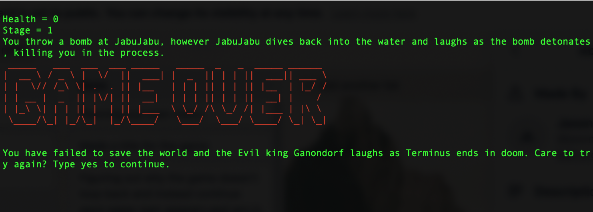
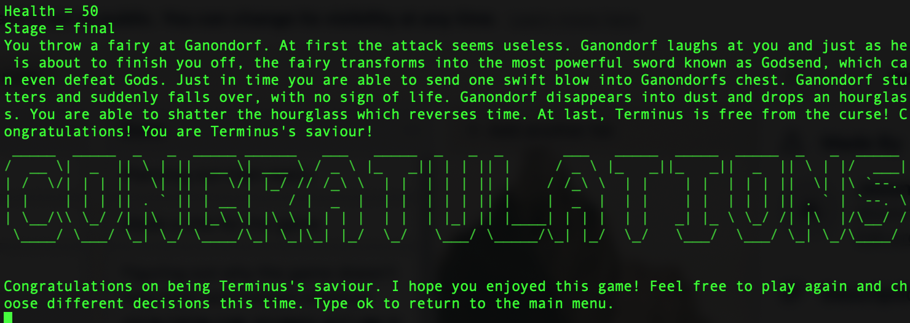
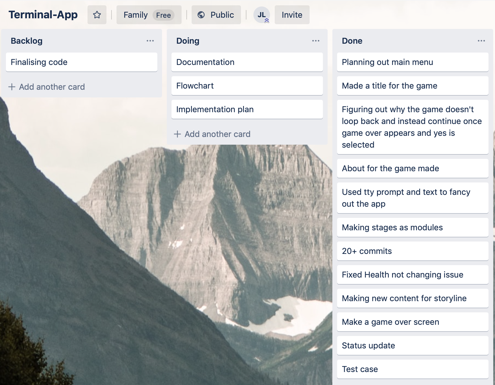
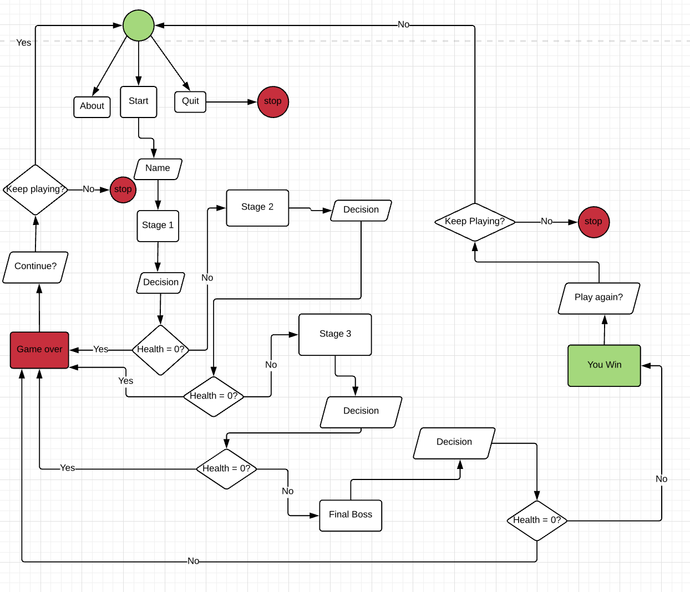

# Save-Terminus

The aim of the project is to create a text based short adventure game using fundamentals of the computer language Ruby. In this project I created a text adventure game named Save Terminus. This game tells the story about an evil king who has invaded world and put a curse on it, reversing the time of the world known as Terminus. In order to save the world, the player will choose their own adventure and choices and try to survive the stages leading up to the final boss. The goal of the game is to defeat him so that the player can turn time back to normal and save the world. 

## Description of the application

This terminal application is a simple text based adventure game which allows the user to play through a storyline, making decisions by inputting the numbers they want and pressing enter. The scope of the idea is pretty simplistic and very much has the same similarity as most adventure games: the basic plot is there is an evil being who takes over the world and the player must stop him. The application is run using Ruby, as it is written in Ruby language.

## Identify the issue that it resolves

This application was made purely for entertainment. Therefore it does not resolve any real life scenarios or issues.

# Software Development Plan

## Statement of Purpose and Scope

The reason why I made this game was because I wanted to see how far my knowledge of Ruby can go. It has only been two weeks since I started learning Ruby,and at the same time I wanted to refresh my mind by trying to create a terminal based game. To me learning by doing is the most efficient method of learning there is, especially since im a pattern learner. This may not be a very hard or advanced terminal application, however it is very good knowing that I am able to write basic Ruby. If I want to be able to make much more complex apps in the future, this can be considered very good practice in preparation for it.

## Target Audience

This Terminal application is primarily targetting kids since most kids loves games. However, it can also be very helpful to people of any age who are interested in learning about the fundamentals of Ruby. Because this is not a very high level project, people with very little experience can break down how the game is made, which will may also help solidify their own learning skills. Another mention is that this program was built on a MacOS, so primarily it is made for MacOS users only, but may or may not work for Windows users as well. As of current there are no other versions so Windows users may have trouble running it on their PCs.

## How will the Audience use it

If the audience wants to use this application, they should refer to the Help file below. It will list which softwares are required to run the game. However, everyone should have VSCode and the gems installed, as that is the basic applications needed to get the game running.

## Features

1) To start playing the game
- User will begin by running the game (see help file below on how to run the game)
- User will be greeted with the main menu with 3 options: Play, About and Quit
- User will select the option they want with arrow keys and press enter on the Play option to play.
- From start to end, the start will always be looped back to the beginning of the game whether you win or lose. This is because the variable health affects the outcome of the game. Once it reaches the outcome of game over or you win, it will loop back to the start of the game, allowing you to choose the 3 options again

2) To run the game from the terminal
- User will first open terminal
- User will first change directory to the file
- User will input ruby app.rb .
- The game should run
- For more information, refer to the help file on how to run the game from terminal.

3) To make a decision in the game
- User will first initialize the game by pressing play
- User will enter their name
- User will be greeted with the introduction to the game
- User will be asked to type a decision using numbers 1-4 as shown on the screen
- Once user has typed in the number they press enter 
- The user will see the outcome of the decision they have made. They might or might not lose the game based on their decision that they have made.
- In this feature, the loop has been made for a decision. The loop is that decisions will continue and so will the stage until all health is lost or if you win the game. If you lose the game, it loops right back to the beginning where you can make the same decision by replaying the game.

4) To quit the game
- User will select the option quit
- The game should exit and the user will be back in the terminal shell 
- The exit command has a loop of a condition for as long as the main menu option isnt exit, the game will keep running until the exit option is hit. Then the game will break.

## User Interaction and Experience

Most of the user interaction will be located in the help file provided here on github. However listed in the code there are many comments. Users may refer to comments to see exactly what each part of code is doing whilst it runs. Also because this is a game, there are not many ways the game is able to manually handle errors, since it is expected that they game will run from start to finish. However, there may be soft bugs present which might appear after a certain set of functions are executed. However there are two primary two user interactions, which are to test for the game over screen and the you win screen.

1) To check for whether game over works, the user must play the game until his health reaches 0. As soon as the health reaches 0 game over will appear. Then the user should be greeted with the screen:



2) To check for whether the winning screen will appear once we have beaten the game, the user must reach the end of the game with more than 0 health. When this happens the user would have defeated the last boss of the game, and will get the screen:



# Software Implementation Plan

Here is the software implementation plan used during the creation of this game.

## Check if the game ends once you reach 0 health

| Task                                                    | Duration   | Priority |
|---------------------------------------------------------|------------|----------|
| Game over function made                                 | 20 minutes | High     |
| Health reaches 0 as a condition for game over to appear | 1 hour     | High     |
| Game over screen will appear once the its game over     | 30 minutes | High     |
| Game over will not crash the game                       | 5 minutes  | High     |

## Check if the win screen appears once you have won

| Task                                                                    | Duration   | Priority |
|-------------------------------------------------------------------------|------------|----------|
| Winner function made                                                    | 20 minutes | High     |
| Health will be more than 0 after winning the game                       | 2 hours    | High     |
| After winning user will be allowed to restart the game without crashing | 1 hour     | High     |
| Winning the game will display the congratulations logo                  | 5 minutes  | Low      |

## Checking if health stays the same throughout the game

| Task                                             | Duration   | Priority |
|--------------------------------------------------|------------|----------|
| Health will begin at 100                         | 30 minutes | High     |
| Health will decrease as wrong decisions are made | 30 minutes | High     |
| Health will not reset after each stage           | 30 minutes | High     |

## Checking if decisions made are the correct ones during stages

| Task                                            | Duration   | Priority |
|-------------------------------------------------|------------|----------|
| Stage 1 made                                    | 2 hours    | High     |
| Stage 1 text implemented                        | 1 hour     | Medium   |
| number typed will correspond to decision chosen | 30 minutes | High     |

## Project Management tools

Here is the Trello board used for planning the game out. A lot of stuff are done but there are still some more stuff to be done: especially looking for more efficient coding to shorten the code required for making the game.



## Control Flow Diagram

This flowchart shows all the decisions and processes user will go through whilst running the Terminal application: 



# Help File

Make sure ruby is installed. This is the most important thing.

## Getting Started

To begin, make sure that the ruby gem is installed. we will need all the gems listed below:
1) tty-prompt
2) tty-font
3) pry
4) colorize

After all the gems are installed, install VSCode. VSCode will work for both MacOS and Windows. Also ensure all the files of the app are installed, as some require others to be in the same directory in order for it to work. There are a total of 8 files which are required to get the game running (except test).

### Prerequisites

To install the gems, you would first need a terminal. In MacOS this is already built in but if on Windows, you must find a terminal app to download. 

### Installing

1) Install VSCode by looking up the website and downloading it.
2) Install the gems by typing in gem install (name_of_gem) eg gem install pry will install pry. You should have these commands executed:
```
    gem install tty-prompt
    gem install tty-font
    gem install pry
    gem install colorize


To run the app follow the steps below.

1. Make sure you have ruby installed on your machine.

2. Clone the repo.

```txt
git clone name.git
```
3. `cd` into the directory you've cloned

4. Run the build shell script

```txt
bash build.sh
```

5. Cd into the `dist` directory

6. Run the following command.

```txt
ruby app.rb
```

7. If you want to start the add in advanced mode

```txt
ruby app.rb -a
```

## Running the tests

Here is an example of running a test to see whether the health will be updated after stage 1 of the game:

```
def test_stage_one
  # what we want the test to do
  # test stage_one method to ensure that health is not equal to 100 once updated

  # dummy data
  health = 100

  # call the method
  updated_health = StageOne.run(health)

  # write the test
  if updated_health != 100
    # the test passes
    puts 'The test passes!'.colorize(:green)
  # do not choose option 4 as health is not lost
  else
    # the test fails
    puts 'The test fails!'.colorize(:red)
  end
end
test_stage_one
```
Heres another example of running a test but this time we will be testing to see whether the variable health is an integer:

```
def test_stage_two
  # what we want the test to do
  # test stage_two method to ensure that an integer is being returned

  # dummy data
  health = 100

  # call the method
  updated_health = StageTwo.run(health)

  # write the test
  if updated_health.class == Integer
    # the test passes
    puts 'The test passes!'.colorize(:green)
  else
    # the test fails
    puts 'The test fails!'.colorize(:red)
  end
end
test_stage_two
```
## Built With

* [VScode](https://code.visualstudio.com) - The web framework used
* [tty-prompt](https://github.com/piotrmurach/tty-prompt) - gem for menu buttons
* [tty-font](https://github.com/piotrmurach/tty-font) - gem for font text
* [colorize](https://github.com/fazibear/colorize) - gem for putting different colors on text
* [pry](https://github.com/pry/pry) - gem for interactions and calculations on ruby
* [rubocop](https://github.com/rubocop-hq/rubocop) - gem for organizing code into a neat format 


## Authors

* **Jason Liu** - *Initial work* - [jason20194](https://github.com/jason20194)


