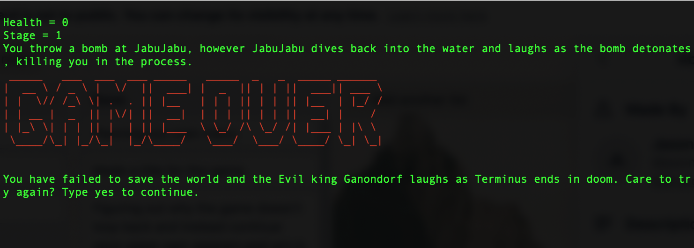
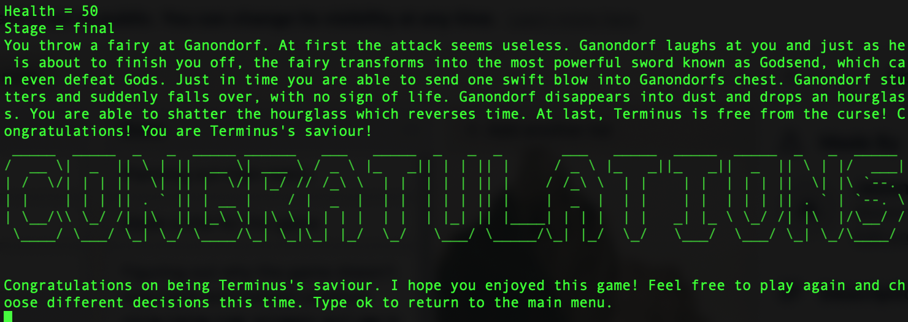
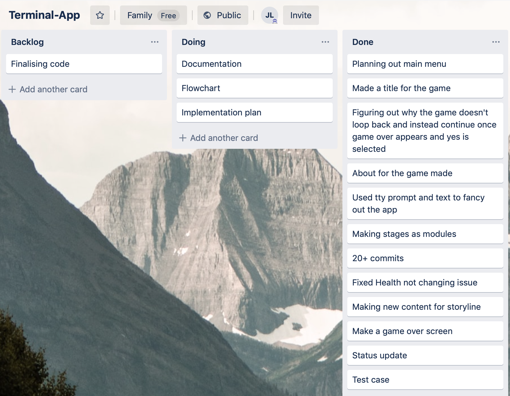
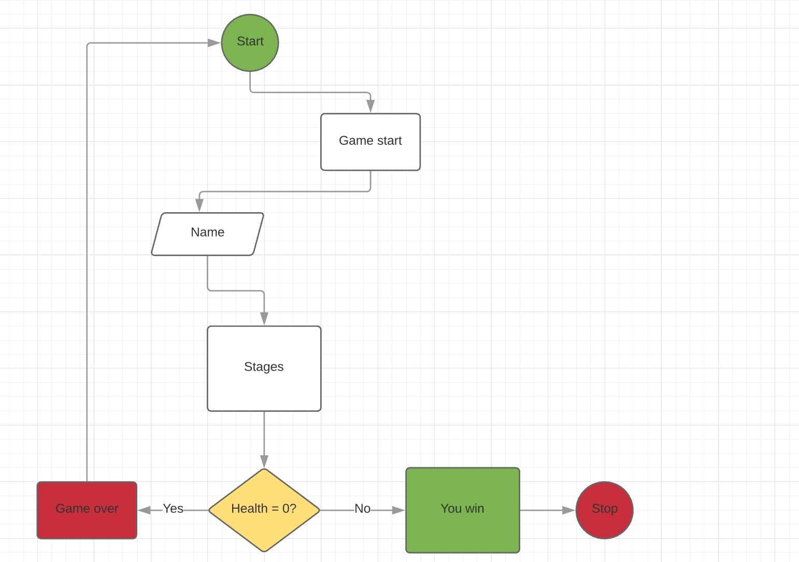

## Description of the application

This terminal application is a simple text based adventure game which allows the user to play through a storyline, making decisions by inputting the numbers they want. The scope of the idea is pretty simplistic and very much has the same similarity as most adventure games: the basic plot is there is an evil being which takes over the world and the player must stop him. The application is run using ruby, as it is written in ruby language.

## Identify the issue that it resolves

This application was made purely for entertainment. Therefore it does not resolve any real life scenarios or issues.

## Statement of Purpose and Scope

The reason why I made this game was because I wanted to see how far my knowledge of ruby can go. It has only been 2 weeks since I learnt ruby, so at the same time I wanted to refresh my mind by trying to create a terminal based game. To me learning by doing is the most efficient method of learning there can ever be, especially since im a pattern learner. This may not be a very hard or advanced terminal application, however it is very good knowing that I am able to write basic ruby. If I want to be able to make much more complex apps in the future, this can be considered very good practice in preparation for it.

## Target Audience

This Terminal application is primarily targetting kids since most kids loves games. However, it can also be very helpful to people of any age who are interested in learning about the fundamentals of Ruby. Because this is not a very high level project, people with very little experience can break down how the game is made, which will may also help solidify their ruby skills. Another mention is that this program was built on a MacOS, so primarily it is made for MacOS users. As of current there are no other versions so Windows users may have trouble running it on their PCs.

## How will the Audience use it

If the audience wants to use this application, they should refer to the README file. It will explain what software is required to run the game. However, they should have VSCode and the gems installed, as that is the basics needed to get the game running.

## Features

1) To start playing the game
- User will begin by running the game
- User will be greeted with the Main menu with 3 options: play, about and quit
- User will select the option they want with arrow keys and press enter on the Play option to play.
- From start to end, the start will always be looped back to the beginning of the game whether you win or lose. This is because    the variable health affects the outcome of the game. Once it reaches the outcome of game over or you win, it will loop back to the start of the game, allowing you to choose the 3 options again

2) To run the game from the terminal
- User will first open terminal
- User will first change directory to the file
- User will input ruby app.rb .
- The game should run

3) To make a decision in the game
- User will first initialize the game by pressing play
- User will enter their name
- User will be greeted with the introduction to the game
- User will be asked to type a decision using numbers 1-4 as shown on the screen
- Once user has typed in the number they press enter 
- The user will see the outcome of the decision they have made. They might or might not lose the game based on their decision that they have made.
- In this feature, the loop has been made for a decision. The loop is that decisions will continue and so will the stage until all health is lost or if you win the game. If you lose the game, it loops right back to the beginning where you can make the same decision by replaying the game.

4) To quit the game
- User will select the option quit
- The game should exit and the user will be back in the terminal shell 
- The exit command has a loop of a condition for as long as the main menu option isnt exit, the game will keep running until the exit option is hit. Then the game will break.

## User Interaction and Experience

Most of the user interaction will be located in the README help file provided on github. However listed in the code there are many comments. Users may refer to comments to see exactly what each part of code is doing. Also because this is a game, there are not many ways we are able to manually handle errors, since it is expected that they game will run from start to finish. However, there may be soft bugs present which might appear after a certain set of functions are executed. However we can have 2 user interactions,which are to test for the game over screen and the you win screen.

1) To check for whether game over works, the user must play the game until his health reaches 0. As soon as the health reaches 0 game over will appear. Then the user should be greeted with the screen:

2) To check for whether the winning screen will appear once we have beaten the game, the user must reach the end of the game with more than 0 health. When this happens the user would have defeated the last boss of the game, and will get the screen:

## Project Management tools

Here is my Trello board used for planning my project out. A lot of stuff are done but there are still some more stuff to be done:

## Flowchart

This flowchart shows the decisions and processes for the start game option in the Terminal application: 

